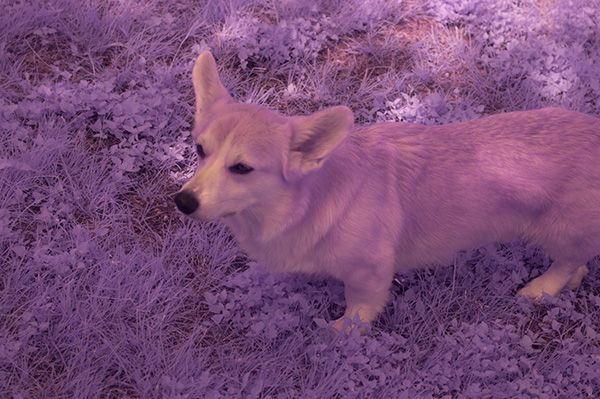
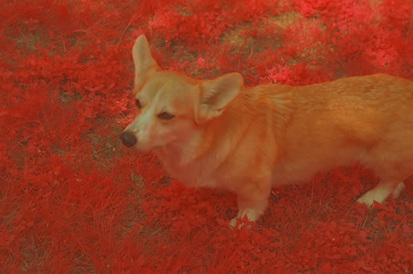
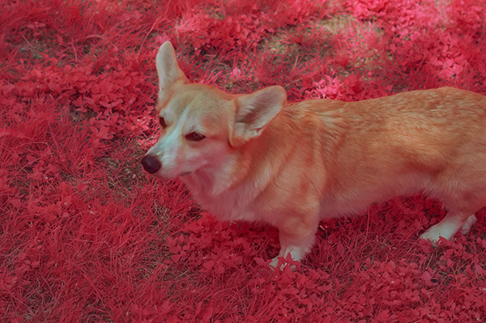

# Infrared Red Green (IRG)
Processing Tools for IRG photos v1.0.0

# What does this do
This package processes images captured on full spectrum camera with yellow filter. Photographs produced in this manner have three colour channels Infrared Red and Green as opposed to regular natural colour images with Red Green and Blue channels. IRG photos are considered more asthetically appealing when processed so that the Infrared channel is mapped to the Red channel. To make way for this the Red channel is moved to the Green channel and the Green channel to the Blue. Before the channels can be rearranged any Infrared component which as leaked into the other channels is subtracted. 

# Setup
Install python from https://www.python.org/downloads/

Create a virtualenv inside the project folder:

```shell
$ cd irg
$ python3 -m venv .venv
```

Now, activate the corresponding environment. On OS X and Linux, do the following:

```shell
$ . .venv/bin/activate
(venv) $
```

If you are a Windows user, the following command is for you:

```shell
> .venv\scripts\activate
(venv) >
```

And if you want to stop using the virtualenv, use the following command:

```shell
$ deactivate
```

Enter the following command to get all the dependencies installed in your virtualenv:

```shell
$ pip install -r requirements.txt
```

# How to use
You can use this script from the command line `python irg.py docs/demo.jpg`

# Example
Input:



Output:



Whitebalanced in photoshop:



